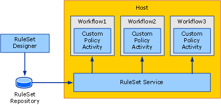
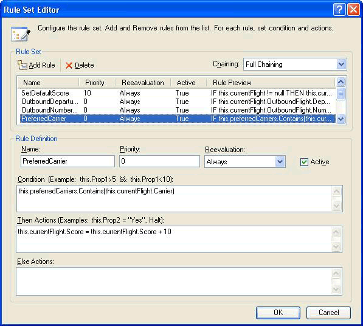
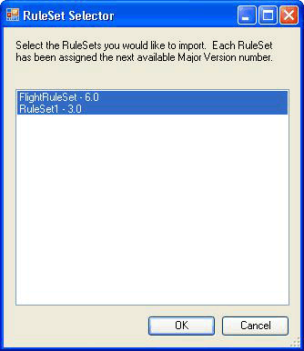

# External Ruleset Toolkit

Normally when rules are used within a workflow application, the rules are part of the assembly. In some scenarios, you may want to maintain the RuleSets separately from the assembly so that they can be updated without rebuilding and deploying the workflow assembly. This sample allows you to manage and edit RuleSets in a database and access those RuleSets from a workflow at runtime. This enables running workflow instances to automatically incorporate RuleSet changes.

The External RuleSet Toolkit sample contains a Windows Forms-based tool that you can use to manage and edit RuleSet versions in a database. It also includes an activity and a host service for executing those rules.

> [!NOTE]
> This sample requires [Microsoft SQL Server](https://go.microsoft.com/fwlink/?LinkId=96181).

Visual Studio provides a RuleSet editor as part of the Windows Workflow Foundation (WF). You can start this editor by double-clicking the `Policy` activity in a workflow; it serializes the defined RuleSet object to the .rules file associated with the workflow (a `Policy` activity runs a RuleSet instance against the workflow). The .rules file is compiled into the assembly as a resource when you build the workflow project.

The components of this sample include:

- A RuleSet graphical user interface tool that you can use to edit and manage RuleSet versions in the database.

- A RuleSet service that is configured on the host application and accesses RuleSets from the database.

- An `ExternalPolicy` activity that requests a RuleSet from the RuleSet service and runs the RuleSet against the workflow.

The interaction of the components is shown in the following image. The sections that follow describe each component.



> [!IMPORTANT]
> The samples may already be installed on your machine. Check for the following (default) directory before continuing.
>
> `<InstallDrive>:\WF_WCF_Samples`
>
> If this directory does not exist, go to [Windows Communication Foundation (WCF) and Windows Workflow Foundation (WF) Samples for .NET Framework 4](https://go.microsoft.com/fwlink/?LinkId=150780) to download all Windows Communication Foundation (WCF) and [!INCLUDE[wf1](../../../../includes/wf1-md.md)] samples. This sample is located in the following directory.
>
> `<InstallDrive>:\WF_WCF_Samples\WF\Scenario\ExternalRuleSetToolKit`

## RuleSet Tool

A screenshot of the RuleSet tool is shown below. From the **Rule Store** menu, you can load the available RuleSets from the database and save modified RuleSets back to the store. An application configuration file provides a database connection string for the RuleSet database. When you start the tool, it automatically loads the RuleSets from the configured database.


The RuleSet tool applies major and minor version numbers to the RuleSets, allowing you to simultaneously maintain and store multiple versions (the tool provides no locking or other configuration management features in addition to the versioning capability). Using the tool, you can create new RuleSet versions or delete existing versions. When you click **New**, the tool creates a new RuleSet name and applies version 1.0. When you copy a version, the tool creates a copy of the selected RuleSet version, including the contained rules, and assigns new, unique version numbers. These version numbers are based on the version numbers of existing RuleSets. You can change the RuleSet name and version numbers using the associated fields on the form.

When you click **Edit Rules**, the RuleSet editor starts, as shown in the following image:



This is a re-hosting of the editor dialog that is part of the Windows Workflow Foundation Visual Studio add-in. It provides the same functionality, including Intellisense support. The rules are authored against a target type (such as a workflow) that is associated with the RuleSet in the tool; when you click **Browse** in the main tool dialog, the **Workflow/Type Selector** dialog appears, as shown in Figure 4.


Figure 4: Workflow/Type Selector

You can use the **Workflow/Type Selector** dialog to specify an assembly and a specific type within that assembly. This type is the target type against which the rules are authored (and run). In many cases, the target type is a workflow or some other activity type. However, you can run a RuleSet against any .NET type.

The path to the assembly file and the type `name are stored with the` RuleSet in the database, so that when the RuleSet is retrieved from the database, the tool attempts to automatically load the target type.

When you click **OK** in the **Workflow/Type Selector** dialog, it validates the selected type against the RuleSet, to ensure that the target type has all the members referenced by the rules. Errors are shown in a **Validation Errors** dialog. You can choose to continue with the change despite the errors, or click **Cancel**. From the **Tools** menu in the main tool dialog, you can click **Validate** to re-validate the RuleSet version against the target activity.


From the **Data** menu in the tool, you can import and export RuleSets. When you click **Import**, a file-chooser dialog appears, from which you can select a .rules file. This may or may not be a file initially created in Visual Studio. The .rules file should contain a serialized `RuleDefinitions` instance that contains a collection of conditions and a collection of RuleSets. The tool does not use the conditions collection, but it does use the `RuleDefinitions` .rules format to allow interaction with the Visual Studio environment.

After selecting a .rules file, a **RuleSet Selector** dialog appears. You can use the dialog to select the RuleSets from the file that you want to import (the default specifies all RuleSets). RuleSets in the .rules file do not have version numbers, because their versioning within a WF project is the same as the version of the assembly. During the importing process, the tool automatically assigns the next available major version number (which you can change after importing); you can see the assigned version numbers in the **RuleSet Selector** list.

For each RuleSet it imports, the tool attempts to locate the associated type from the bin\Debug folder under the location of the .rules file (if it exists), based on the members used in the RuleSet. If the tool finds multiple matching types, it attempts to choose a type based on a match between the .rules file name and the type name (for example, the `Workflow1` type corresponds to Workflow1.rules). If multiple matches exist, you are prompted to select the type. If this auto-identification mechanism fails to locate a matching assembly or type, then after importing you can click **Browse** on the main tool dialog to navigate to the associated type.



When you click **Data-Export** from the main tool menu, the **RuleSet Selector** dialog appears again, from which you can determine the RuleSets from the database that should be exported. When you click **OK**, a **Save File** dialog appears, in which you can specify the name and location of the resulting .rules file. Because the .rules file does not contain version information, you can only select one RuleSet version with a given RuleSet name.

## PolicyFromService Activity

The code for the `PolicyFromService` activity is straightforward. It works much like the `Policy` activity provided with WF, but instead of retrieving the target RuleSet from the .rules file, it calls a host service to obtain the RuleSet instance. It then runs the RuleSet against the root workflow activity instance.

To use the activity in a workflow, add a reference to the `PolicyActivities` and `RuleSetService` assemblies from your workflow project. See the procedure at the end of this topic for a discussion of how to add the activity to the toolbox.

After placing the activity in your workflow, you must provide the name of the RuleSet to be run. You can enter the name as a literal value, or bind to a workflow variable or property of another activity. Optionally, you can enter version numbers for the specific RuleSet that should be run. If you leave the default value of 0 for the major and minor version numbers, the latest version number in the database is automatically provided for the activity.

## RuleSet Service

The service is responsible for retrieving the specified RuleSet version from the database and returning it to the calling activity. As previously discussed, if the major and minor version values passed in the `GetRuleSet` call are both 0, the service retrieves the latest version. At this point, there is no caching of RuleSet definitions or instances; similarly, there are no features for marking RuleSet versions as "deployed" to differentiate them from in-progress RuleSets.

The database to be accessed by the service should be configured on the host using an application configuration file.

#### To run the tool

1. The folder that sets up the RuleSet table used by the tool and the service contains a Setup.sql file. You can run the Setup.cmd batch file to create the Rules database on SQL Express and to set up the RuleSet table.

2. If you edit the batch file or Setup.sql and specify not to use SQL Express or to place the table in a database named something other than `Rules`, the application configuration files in the RuleSet tool and `UsageSample` projects should be edited with the same information.

3. After you run the Setup.sql script, you can build the `ExternalRuleSetToolkit` solution and then launch the RuleSet tool from the ExternalRuleSetTool project.

4. The `RuleSetToolkitUsageSample` Sequential Workflow Console Application solution includes a sample workflow. The workflow consists of a `PolicyFromService` activity and two variables, `orderValue` and `discount`, against which the target RuleSet runs.

5. To use the sample, build the `RuleSetToolkitUsageSample` solution. Then from the RuleSet tool main menu, click **Data-Import** and point to the DiscountRuleSet.rules file in the RuleSetToolkitUsageSample folder. Click the **Rule Store-Save** menu option to save the imported RuleSet to the database.

6. Because the `PolicyActivities` assembly is referenced from the sample workflow project, the `PolicyFromService` activity appears in the workflow. It does not, however, appear in the toolbox by default. To add it to the toolbox, do the following:

    - Right-click the toolbox and select **Choose Items** (this may take a while).

    - When the **Choose Toolbox Items** dialog appears, click the **Activities** tab.

    - Browse to the `PolicyActivities` assembly in the `ExternalRuleSetToolkit` solution and click **Open**.

    - Ensure that the `PolicyFromService` activity is selected in the **Choose Toolbox Items** dialog and then click **OK**.

    - The activity should now appear in the toolbox in the **RuleSetToolkitUsageSample Components** category.

7. The RuleSet service is already configured on the console application host using the following statement in Program.cs.

    ```csharp
    workflowRuntime.AddService(new RuleSetService());
    ```

8. You can also configure the service on the host using a configuration file; see the SDK documentation for details.

9. An application configuration file is added to the workflow project to specify the connection string for the database to be used by the service. This should be the same connection string used by the RuleSet tool, which points to the database that contains the RuleSet table.

10. You can now run the `RuleSetToolkitUsageSample` project as you would any other workflow console application. Press F5 or Ctrl+F5 within Visual Studio or run the RuleSetToolkitUsageSample.exe file directly.

    > [!NOTE]
    > You must close the RuleSet tool to recompile the usage sample, because the tool loads the usage sample assembly.
